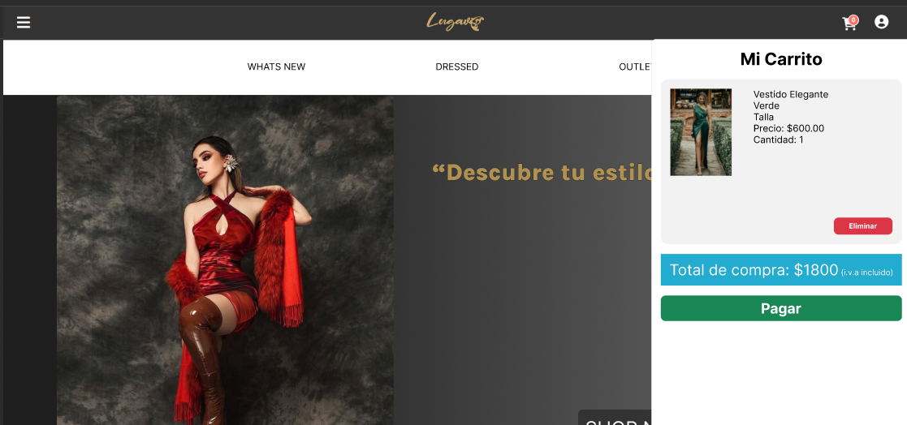
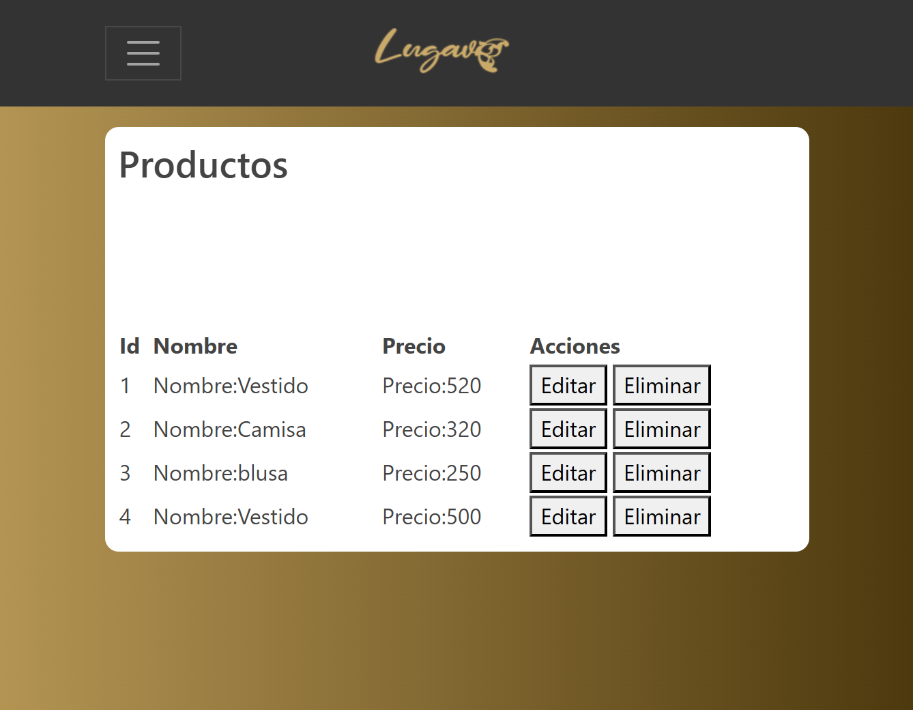
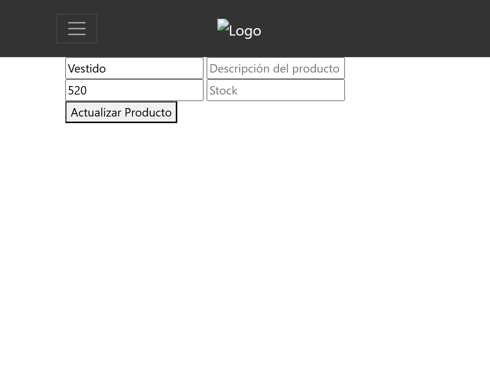

# **Documentación del Sistema** 
  
## Información del Producto  
  
**Nombre del Producto:** Lugavi MX  
  
**Descripción:** Plataforma de comercio electrónico para la compra de vestidos de gala y cocktail.  
  
## Integrantes del Equipo  
  
* Barraza Hernández Henrry Josué  
* Cabanillas Pacheco María Jose  
* Ortiz Burgueño Linda Faviola  
* Ortiz Ortiz Jesús Manuel  
* Pérez Melgoza Jorge Román  
* Quintero Andrade Álvaro Gabriel  
* Rivera García Blanca Angélica  
* Santoyo Terrazas Nadia Guadalupe  

# **1. Introducción**  
  
**Descripción general:** Lugavi MX es una plataforma de comercio electrónico desarrollada para ofrecer una experiencia de compra de vestidos de gala y cocktail. Representa una solución digital moderna y elegante, orientada a posicionar a la marca a nivel nacional e internacional. El sitio web incluye funcionalidades como catálogo de productos, carrito de compras, sistema de pagos seguros, panel de administración y gestión de pedidos.  
  
**Audiencia:** Clientes finales (compradores), administradores del sitio (empleados de Lugavi MX), equipo de desarrollo y soporte técnico.  
  
**Cobertura o alcance:** El sistema cubre desde el registro e inicio de sesión de usuarios hasta la administración de pedidos, productos, pagos y notificaciones, incluyendo integración con redes sociales y seguimiento de envíos. Soporta operaciones tanto en escritorio como en dispositivos móviles.  
  
# **2. Resumen del Sistema**  
  
**Objetivo general:** Desarrollar un sitio web de comercio electrónico para Lugavi MX que proporcione una experiencia de usuario intuitiva, segura y elegante, incrementando el alcance comercial y fortaleciendo la identidad de la marca.  
  
**Características o funcionalidades principales:**  
  
* Catálogo de vestidos con filtros por talla, precio, categoría y color  
* Registro/Login de usuarios  
* Carrito de compras con modificación de cantidades y cálculo total  
* Procesamiento de pagos mediante tarjeta y PayPal  
* Perfil de usuario con historial de pedidos  
* Panel administrativo con CRUD de productos, pedidos, usuarios  
* Notificaciones automáticas por correo y en pantalla  
* Integración con redes sociales para compartir productos  
  
**Arquitectura general del diseño:** Basada en una arquitectura de tres capas:  
  
* **Capa de presentación:** HTML, CSS, Bootstrap, JavaScript  
* **Capa de aplicación:** Node.js + Express (REST API)  
* **Capa de datos:** MongoDB (NoSQL) con Mongoose  
  
**Diagrama de arquitectura:** 
  
# **3. Requisitos**
  
  **Funcionales:**    
Los principales requisitos funcionales de la plataforma de comercio electrónico Lugavi MX son:

-   **Iniciar sesión:** Permite a los usuarios registrados acceder al sistema.
    
-   **Catálogo de vestidos:** Permite a los usuarios visualizar los productos disponibles y sus detalles.
    
-   **Filtro de búsqueda:** Permite a los usuarios buscar productos según sus características.
    
-   **Carrito de compras:** Permite a los clientes gestionar los productos seleccionados para comprar.
    
-   **Proceso de pago:** Permite a los clientes pagar los productos seleccionados.
    
-   **Gestión de pedidos:** Permite al administrador gestionar los pedidos y notificar al cliente.
    
-   **Perfil usuario:** Permite a los clientes gestionar su información personal.
    
-   **Gestión de inventario:** Permite al administrador gestionar el inventario del sistema.
    
-   **Notificaciones:** Permite al sistema enviar notificaciones a clientes y administradores.
    
-   **Integración con Redes Sociales:** Permite a los clientes compartir productos en redes sociales.
    
-   **Informes y Estadísticas:** Permite al administrador generar y visualizar informes del sistema.

**No funcionales:**  
  
* Interfaz responsiva y atractiva  
* Seguridad en autenticación y pagos  
* Escalabilidad para incluir nuevos módulos  
* Alto rendimiento bajo carga concurrente  
* Acceso continuo 24/7 desde cualquier dispositivo  
  
**Técnicos:**  
  
* **Lenguajes:** JavaScript (frontend y backend)  
* **Frameworks/Librerías**: Express.js, Bootstrap, Mongoose, bcryptjs, dotenv  
* **Base de datos:** MongoDB 6.0  
* **Herramientas:** Figma (prototipado), GitHub (control de versiones), VS Code  
**Arquitectura del sistema:**  
* Modularidad mediante rutas y controladores en Node.js  
* Componentes RESTful: usuarios, artículos, pedidos, pagos  
* Frontend estático y API desacoplada para interoperabilidad  
  
# **4. Instalación**  
  
**Requisitos de software:**  
  
* Node.js (v18 o superior)  
* Express.js
* MongoDB local o en Atlas  
* Navegador actualizado (Chrome, Firefox)  
  
**Requisitos de hardware:**  
  
* 4GB RAM mínimo  
* Procesador 2 GHz  
* 1GB de espacio libre  
  
**Pasos detallados para instalación:**  
    
* **Requisitos de Software:**
    * **Node.js:** Asegúrate de tener Node.js versión 18 o superior instalado en tu sistema.
        * Puedes verificar la versión con el comando `node -v` en la terminal.
        * Si no lo tienes, descárgalo e instálalo desde el [sitio web oficial de Node.js](https://nodejs.org/).
    * **Express.js:** Express.js se instalará posteriormente usando npm (Node Package Manager), que viene con Node.js. No es una instalación separada inicialmente, pero es una dependencia del proyecto.
    * **MongoDB:** Decide si usarás MongoDB localmente o MongoDB Atlas (en la nube).
        * **Local:** Si es local, descarga e instala MongoDB Community Server en tu sistema. Asegúrate de que el servicio de MongoDB esté en ejecución.
        * **Atlas:** Si es Atlas, crea una cuenta en [MongoDB Atlas](https://www.mongodb.com/) y configura un clúster. Obtén la cadena de conexión.
    * **Navegador:** Utiliza un navegador actualizado como Chrome o Firefox para las pruebas y el uso.
* **Requisitos de Hardware:**
    * **RAM:** Tu sistema debe tener al menos 4GB de RAM.
    * **Procesador:** Se recomienda un procesador con una velocidad de 2 GHz o superior.
    * **Espacio Libre:** Asegúrate de tener al menos 1GB de espacio libre en disco. Esto es para los archivos del proyecto, la base de datos (si es local) y otros archivos temporales.

**Pasos para la instalación:**

1.  Clona el repositorio de GitHub:

    \`\`\`
    git clone [https://github.com/tu-usuario/lugavi-mx.git](https://github.com/jrp03/Equipo2_LugaviMx)
    cd lugavi-mx
    \`\`\`
2.  Instala las dependencias del backend, incluyendo Express.js:

    \`\`\`
    cd backend
    npm install
    \`\`\`

    * Este comando instalará todas las dependencias listadas en el archivo `package.json`, incluyendo Express.js.
3.  Crea el archivo de configuración de las variables de entorno:

    \`\`\`
    cp .env.example .env
    \`\`\`
4.  Edita el archivo `.env` y configura las variables de entorno:

    \`\`\`
    MONGO_URI=mongodb://localhost:27017/lugavi # o tu cadena de conexión de Atlas
    PORT=3000
    \`\`\`
5.  Inicia la base de datos MongoDB. Si estás usando MongoDB local, asegúrate de que el servicio esté en ejecución. Si estás usando MongoDB Atlas, asegúrate de que tu clúster esté activo y la cadena de conexión sea correcta.
6.  Inicia el servidor de Node.js:

    \`\`\`
    npm start
    \`\`\`
7.  Abre la aplicación en tu navegador web:

    \`\`\`
    frontend/index.html
    \`\`\`
    O, si tienes un servidor configurado para servir los archivos estáticos del frontend, accede a la URL correspondiente.

    
**Estructura de carpetas:**  
   
Equipo2_LugaviMx
├── .github
├── node_modules
├── origen
├── README.md 
├── package-lock.json 
└── package.json 

# **5. Uso del Sistema**  
  
## **Guía detallada para usuarios (Cliente)**  
  
Esta guía explica paso a paso cómo un cliente puede navegar y utilizar todas las funciones esenciales del sistema Lugavi MX:  
  
**Paso 1: Ingresar al sitio web**  
  
Abre el navegador y escribe la URL del sitio web de Lugavi MX. 
* https://lugavi-mx.github.io/Web/
* Verás la página de inicio con opciones para iniciar sesión o registrarte.  
  
**Paso 2: Registro de nuevo usuario**  
  
* Haz clic en "Regístrate".  
* Completa el formulario con: nombre completo, correo electrónico, contraseña.  
* Verifica que los datos sean correctos y haz clic en “Registrarse”.  
* Recibirás un correo de confirmación (si aplica).  
  
**Paso 3: Inicio de sesión**  
  
* En la página principal, haz clic en “Iniciar sesión”.  
* Introduce tu correo y contraseña.  
* Si los datos son correctos, accederás al panel de usuario.  
  
**Paso 4: Navegar por el catálogo**  
  
* Desde el menú superior, selecciona “Catálogo”.  
* Filtra los productos por categoría, talla, color o precio.  
* Haz clic sobre un producto para ver su ficha detallada.  
  
**Paso 5: Agregar productos al carrito**  
  
* En la ficha del producto, selecciona la talla y cantidad.  
* Presiona el botón “Agregar al carrito”.  
* Aparecerá una notificación indicando que el producto fue agregado.  
  
**Paso 6: Revisar y modificar el carrito**  
  
* Haz clic en el ícono del carrito (parte superior derecha).  
* Verás una lista con todos los productos agregados.  
* Puedes cambiar la cantidad o eliminar productos.  
* El total se actualiza automáticamente.  
  
**Paso 7: Realizar una compra**  
  
* Desde el carrito, presiona “Proceder al pago”.  
* Elige o agrega una dirección de envío.  
* Selecciona método de pago (tarjeta o PayPal).  
* Confirma la compra.  
* Recibirás un mensaje de éxito.  
  
**Paso 8: Consultar tus pedidos**  
  
* En el menú, selecciona “Mis pedidos”.  
* Verás un historial con los pedidos realizados, su fecha, estado y total.  
  
**Paso 9: Actualizar tu perfil**  
  
* Haz clic en “Perfil”.  
* Desde ahí puedes modificar tus datos personales, cambiar tu contraseña o gestionar direcciones de envío.  
  
**Paso 10: Cerrar sesión**  
  
* Desde el menú superior, haz clic en “Cerrar sesión” para salir del sistema de forma segura.  
  
Esta guía asegura una experiencia clara y accesible para todos los usuarios que interactúan con la tienda en línea de Lugavi MX.  
  
## **Guía detallada para usuarios (Administrador)**  
  
Esta sección describe el flujo de trabajo para el administrador del sistema Lugavi MX, encargado de gestionar productos, pedidos, usuarios y generar reportes.  
  
**Paso 1: Iniciar sesión como administrador**  
  
* Accede al sitio web de Lugavi MX.  
* Introduce el correo y contraseña de administrador previamente asignados.  
* Serás redirigido al panel administrativo si las credenciales son válidas.  
  
**Paso 2: Acceder al panel de administración**  
  
* Desde el menú, selecciona la opción “Panel de control” o “Administrador”.  
* Verás un tablero con accesos rápidos a módulos clave: productos, pedidos, usuarios, estadísticas.  
  
**Paso 3: Gestión de productos**  
  
* Ir a la sección “Artículos” o “Productos”.  
**Acciones disponibles:**  
* Crear nuevo artículo (vestido): ingresar nombre, descripción, talla, precio, stock, categoría, imagen.  
* Editar artículo existente.  
* Eliminar artículos.  
* Filtrar y buscar artículos por nombre o categoría.  
  
**Paso 4: Gestión de pedidos**  
  
* Accede a “Pedidos”.  
* Lista de pedidos ordenados por fecha o estado.  
**Acciones disponibles:**  
* Ver detalles del pedido: cliente, artículos, monto total.  
* Cambiar el estado del pedido (pendiente, enviado, entregado).  
* Añadir comentarios o activar notificaciones al cliente.  
  
**Paso 5: Gestión de usuarios (clientes)**  
  
* Ir a la sección “Clientes”.  
* Consultar lista de usuarios registrados.  
**Acciones disponibles:**  
* Ver historial de pedidos por cliente.  
* Ver/editar información básica del cliente.  
* Suspender cuentas en caso de actividad sospechosa.  
  
**Paso 6: Consultar estadísticas**  
  
* Ir a la sección “Informes” o “Estadísticas”.  
**Visualizar gráficas y reportes de:**  
* Ventas totales por mes.  
* Productos más vendidos.  
* Usuarios más activos.  
* Estados de pedidos.  
  
**Paso 7: Gestión del inventario**  
  
* Desde “Productos”, verificar stock.  
* El sistema puede notificar automáticamente cuando un artículo tiene bajo inventario.  
  
**Paso 8: Cerrar sesión**  
  
* Desde el menú superior, seleccionar “Cerrar sesión” para proteger el acceso administrativo.  
  
Esta guía proporciona al administrador una ruta clara para el uso eficiente del sistema, facilitando la operatividad de la tienda virtual de Lugavi MX.  
  
## **Flujo de procesos:**  
**Flujo de Procesos General**

El flujo de uso para el usuario final dentro del sistema Lugavi MX se divide en dos perfiles principales: Cliente y Administrador.

-   **Cliente:**
    -   Login → Catálogo → Carrito → Pago → Pedido → Confirmación por correo
        
-   **Administrador:**
    -   Gestión de recursos del sistema (clientes, pedidos, artículos).
        

**Flujos de Procesos Detallados por Funcionalidad**
  
**A. Cliente (comprador)**  
  
**Inicio de sesión o registro**  
  
* El usuario accede al sitio web.  
* Si ya tiene cuenta: ingresa correo y contraseña.  
* Si es nuevo: completa el formulario de registro.  
  
**Exploración del catálogo**  
  
* Navega por la página principal o ingresa al menú "Catálogo".  
* Utiliza filtros para buscar por talla, precio, color o categoría.  
* Visualiza productos con imagen, descripción, precio y disponibilidad.  
  
**Gestión del carrito de compras**  
  
* Agrega uno o varios productos.  
* Visualiza el carrito: puede aumentar/disminuir cantidades o eliminar artículos.  
* El sistema actualiza el total en tiempo real.  
  
**Confirmación de pedido**  
  
* Revisa el resumen del carrito.  
* Selecciona una dirección de envío (existente o nueva).  
* Elige un método de pago: tarjeta o PayPal.  
  
**Pago y finalización**  
  
* Completa los datos necesarios para el pago.  
* Confirma la compra.  
* Recibe una notificación por correo con el resumen del pedido.  
  
**Seguimiento y perfil**  
  
* Accede a "Mis Pedidos" para revisar el estado de cada orden.  
* Desde su perfil puede cambiar contraseñas, actualizar datos o gestionar direcciones.  
  
**B. Administrador (gestión del sistema)**  
  
**Inicio de sesión administrativo**  
  
* Accede con cuenta de administrador (nivel de acceso).  
  
**Gestión de productos**  
  
* CRUD de artículos (agregar, editar, eliminar, actualizar stock).  
  
**Gestión de pedidos**  
  
* Visualiza pedidos recibidos, su estado y detalles.  
* Cambia el estado de un pedido: recibido, en proceso, enviado, entregado.  
* Envía notificaciones al cliente sobre cambios en su pedido.  
  
**Gestión de usuarios**  
  
* Ver listado de clientes.  
* Consultar historial de pedidos por usuario.  
  
**Estadísticas**  
  
* Visualiza informes de ventas, productos más vendidos, comportamiento de usuarios.  
  
## **Capturas de pantalla (Prototipo Figma):**  

**Link de prototipo en Figma** 

https://www.figma.com/design/ADwX8H0A2Rza4qLYJAlc0n/DESARROLLO--IMPLEMENTACION--SISTEMAS?node-id=2-2&t=3SwVMCX2I30e7ssr-0   

  
 -   **Página Principal (Inicio):**

  
  
**Descripción:**
  Carrusel de imágenes destacadas de vestidos.
  Menú superior fijo con accesos a: Catálogo, Mi Perfil, Mis Pedidos, Carrito, Cerrar sesión.

 -   **Iniciar Sesión**

  

**Descripción:** 
El proceso de inicio de sesión que se muestra en la imagen consta de los siguientes pasos que el usuario debe seguir:
 - Ingresar Correo Electrónico
 - Ingresar Contraseña
 
Para acceder a su cuenta existente, el usuario debe hacer clic en el botón verde brillante que dice "Iniciar Sesión".

 -   **Registrarse**

  

**Descripción:** 
El proceso de registro que se visualiza en la imagen consta de los siguientes pasos, tal como el usuario los completaría:

 - Ingresar Correo Electrónico
 - Crear Contraseña
 - Confirmar Contraseña
 
**Registrar:** Para completar el proceso de creación de la nueva cuenta, el usuario debe hacer clic en el botón verde brillante que dice "Registrar". Al hacer clic en este botón, se enviarán los datos proporcionados (correo electrónico y contraseña) al servidor para crear la nueva cuenta de usuario.

-   **Catálogo de Productos:**

  
    
**Descripción:** 
Vista en cuadrícula con: Imagen del producto, Nombre, precio, talla, colores, Botón “Agregar al carrito”. 
Filtros laterales por: Categoría, Precio, Color, Talla.
        
-   **Carrito de Compras:**
 
 
 
 **Descripción:**
  Lista de productos seleccionados.
  Opciones para:
  Aumentar/disminuir cantidad, Eliminar producto, Ver total actualizado. Botón “Proceder al pago”.
        
-   **Proceso de Pago:**

  
 
  **Descripción:** 
    Selección de método de pago: tarjeta o PayPal.
  
  -   **Dirección de Envio:**    
 
 
  **Descripción:** 
 Selección de dirección de envío (puede editarla o agregar nueva).


 - **Resumen de la Compra:**
     
 

  **Descripción:** 
  Revisión de productos y total final. Botón “Finalizar compra”.
        
-   **Perfil del Usuario:**

  

   **Descripción:** 
 Visualización de datos personales. 
 Botones para modificar información y cambiar contraseña. 
 Sección de direcciones de envío (añadir, modificar, eliminar).
          
# **6. Base de Datos**  
  
**Modelo de datos:**
El modelo de datos se implementa en MongoDB, utilizando su estructura flexible de colecciones y documentos embebidos.
  
* **Clientes:** Datos personales, carrito y pedidos.
* **Artículos:** Productos en venta.
* **Categorías:** Clasificación de artículos.  
* **Pedidos:** Historial con detalles y estado.  
* **Administradores:** Control de sistema.  
* **Pagos:** Información de transacciones.
  
**Diagrama entidad-relación:** 

 

Las entidades clave incluyen:

-   Cliente
-   Administrador
-   Carrito de Compras
-   Pedido
-   Detalle de Pedido
-   Método de Pago (con especializaciones PagoConTarjeta y PagoConPayPal)
-   Artículo
-   Categoría
-   Dirección de Envío
-   Notificaciones

**Diagrama de clases:** 

   

   
   **Descripción de las Entidades y Relaciones:**

-   **Cliente:**
    -   Atributos: Información personal del cliente.
        
    -   Relaciones: Carrito de Compras (composición 1:1), Pedido (asociación 1:N).
        
-   **Carrito de Compras:**
    -   Atributos: Identificador del carrito.
    -   Relaciones: Cliente (composición 1:1), Artículo (asociación N:M), Pedido (asociación 1:1).
        
-   **Pedido:**
    -   Atributos: Fecha, estado del pedido.
    -   Relaciones: Cliente (asociación 1:N), Detalle de Pedido (composición 1:1), Carrito de Compras (asociación 1:1), Dirección de Envío (composición 1:1), Notificaciones (dependencia).
        
-   **Artículo:**
    -   Atributos: Información del producto (vestido).
        
    -   Relaciones: Categoría (asociación 1:N), Carrito de Compras (asociación N:M), Detalle de Pedido (asociación 1:N).
        
-   **Administrador:**
    -   Atributos: Información del usuario administrador.
        
    -   Relaciones: Cliente (asociación 1:1), Pedido (asociación 1:1).
        
-   **Detalle de Pedido:**
    -   Atributos: Cantidad, precio, subtotal del artículo en un pedido.
        
    -   Relaciones: Pedido (composición 1:1), Artículo (asociación 1:N).
        
-   **Método de Pago:**
    -   Atributos: Información del método de pago.
        
    -   Relaciones: Pedido (asociación 1:N).
        
-   **Dirección de Envío:**
    -   Atributos: Datos de la dirección del cliente.
        
    -   Relaciones: Cliente (asociación 1:N), Pedido (composición 1:1).
        
-   **Categoría:**
    -   Atributos: Tipo de artículo.
        
    -   Relaciones: Artículo (asociación 1:N).
        
-   **Notificaciones:**
    -   Atributos: Mensajes del sistema.
        
    -   Relaciones: Pedido (dependencia)

**Consultas Principales a Base de Datos:**  

 

 - Consulta de administradores
 
 


 - Consulta de artículos
 
  


 - Consulta de cliente Carlos Pérez.
 
  

 
  - Consulta de Categorías.
 
  


  - Consulta de pedidos por cliente
 
  


  - Consulta de pagos
 
  


**Código Ejemplo de Consultas:** 
```javascript  
// Consulta de administradores, obtiene todos los administradores.
db.administradores.find()
  
// Consulta de artículos, muestra todos los artículos con formato legible.
db.articulos.find().pretty()

// Consulta de cliente, esta consulta busca al cliente cuyo nombre es "Carlos Pérez".
db.clientes.findOne({nombre: "Carlos Pérez"})

// Consulta de categorías, esta consulta recupera todos los documentos de la colección "categorías".
db.categorias.find()

// Consulta de pedidos por cliente, esta consulta encuentra todos los pedidos realizados por un cliente en específico.
db.pedidos.find({clienteId: Object ("682a6405ce995e6863cf5482"}))

// Consulta de pagos.
db.pagos.find()
 ```

# **7. Vista formulario actualización de productos**  

En esta sección se muestra el formulario en el cual el admid puede realizar la consulta para la manipulación de los datos de la clase Productos.

### **Formulario**


Los campos del formulario se enlista nombre de producto, descripcion del producto, precio y stock. Se observa una lista desplegable de la categoria del producto y un botón para añadir la imagen del producto. Debajo se muestran los botones para agregar el producto, editar uno existe o eliminar.

### **Lista de Producto**



En la siguiente vista se enlistan los productos que se han almacenado en la base de datos. De lado derecho se añaden los botones para actualizar o eliminar el producto de la lista. Si se selecciona Editar, se re direcciona a la página de actualización. Si se selecciona eliminar, el producto será eliminado de la lista automáticamente. 

### **Lista de Producto**



En la funcion editar se mostrará el nombre y precio del articulo seleccionado. Para actualizar, se llena los campos con la nueva informacion y los datos se sobrescribirán con los viejos. 


